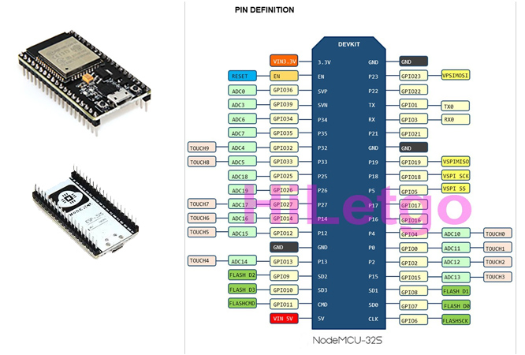
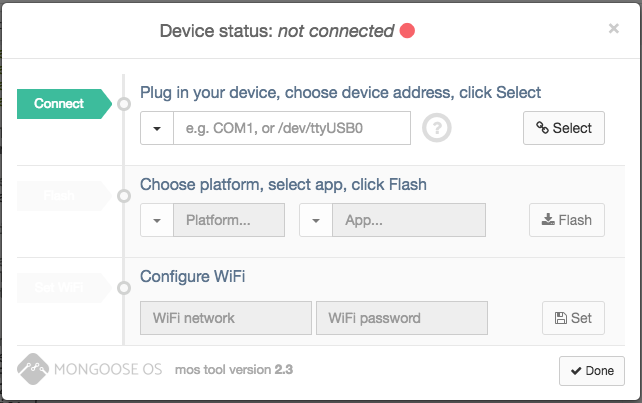
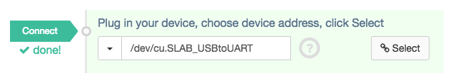
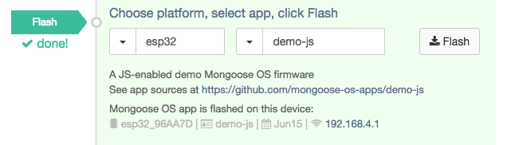
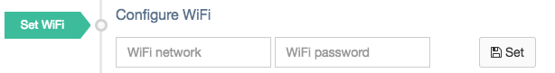
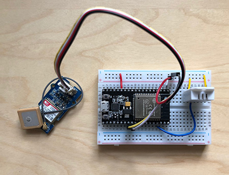
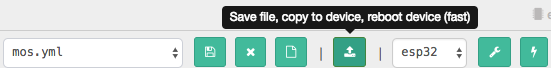
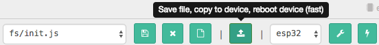
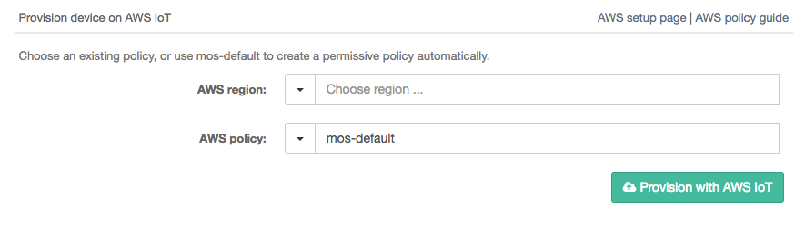

# AWSome IoT Prototyping

Today we will build a completely functional, end-to-end IoT prototype of an asset tracking system using the **ESP32 HiLetGo** development board ([Find it on Amazon](https://www.amazon.com/HiLetgo%C2%AE-ESP-WROOM-32-Development-Microcontroller-Integrated/dp/B0718T232Z)).



. Here are some specs:
- Hybrid Wifi/Bluetooth Chip. ESP32 can interface with other systems to provide Wi-Fi and Bluetooth functionality through its SPI / SDIO or I2C / UART interfaces.
- Built-in antenna switches, RF balun, power amplifier, low-noise receive amplifier, filters, and power management.
- ESP32 achieves ultra-low power consumption with a combination of several types of proprietary software
- ESP32 is capable of functioning reliably in industrial environments, with an operating temperature ranging from –40°C to +125°C.

We will use **AWS** to collect and store the data from the devices. The map-based dashboard will listen for state changes to the device shadow and update in near real time. 

In the second part, we will demonstrate how you could store transactions in a block chain. In the example provided, every update is stored in a blockchain ledger. This method provides all stakeholders a definitive, unalterable history of transactions. This means, they will be able to confirm with certainty the path their shipment took (GPS Sensors), that the shipment was not tampered with (light and motion sensors) and it met environmental requirements (temperature and humidity sensors). The centralized blockchain solution we will use is **Hyperledger Sawtooth on AWS**.

## Pre-requisites

### AWS Environment

Before getting started, make sure you have access to an AWS account and have the AWS CLI installed on your development machine.

- Simple AWS CLI installation with PIP: `pip install awscli --upgrade --user`
- Windows installers: [Download 64bit](https://s3.amazonaws.com/aws-cli/AWSCLI64.msi) | [Download 32bit](https://s3.amazonaws.com/aws-cli/AWSCLI32.msi)

*Complete guide to installing the CLI:*
[https://docs.aws.amazon.com/cli/latest/userguide/installing.html](https://docs.aws.amazon.com/cli/latest/userguide/installing.html)

#### Configure the AWS CLI

- Create a new IAM user with the following permissions
- Attach the following policies to the IAM user: **AWSIoTFullAccess**.
- Create a set of credentials and download the credentials.
- Run `aws configure --profile proto` to create a new profile called 'proto'.
- Put in your credentials and set the region to us-east-1 and the output format to json.

```
:~ user$ aws configure --profile proto
AWS Access Key ID [None]: AFDFDFGKGLGLSKFK
AWS Secret Access Key [None]: f0f0dfkkfKFAf032ask32
Default region name [None]: us-east-1
Default output format [None]: json
```

*[Complete guide](https://docs.aws.amazon.com/IAM/latest/UserGuide/id_users_create.html) to creating IAM resources:*

### Web Development Environment

Node.JS is required to build and run the static website.
- Windows installer: [Download .msi](https://nodejs.org/dist/v8.11.3/node-v8.11.3-x86.msi)
- Mac installer: [Download .pkg](https://nodejs.org/dist/v8.11.3/node-v8.11.3.pkg) 

*[Complete guide](https://nodejs.org/en/download/) to installing node.js.*

### IoT Development Environment

#### Mongoose Tool Chain

- Install the Mongoose OS (MOS) toolchain: [OPTIONAL: For more details, click here](https://mongoose-os.com/software.html)
    - Windows: [Download (.exe)](https://mongoose-os.com/downloads/mos-release/win/mos.exe)
    - Mac:
        ```
       curl -fsSL https://mongoose-os.com/downloads/mos/install.sh | /bin/bash
        ~/.mos/bin/mos --help      
        ```

*[Complete guide](https://docs.aws.amazon.com/IAM/latest/UserGuide/id_users_create.html) to installing Mongoose:*

- Download, unzip and run the SILabs Driver installer for ESP32:
   - Windows: [Win10 Universal Download](https://www.silabs.com/documents/public/software/CP210x_Universal_Windows_Driver.zip), [Win7-10 Download](https://www.silabs.com/documents/public/software/CP210x_Windows_Drivers.zip)
   - Mac: [Download (.zip)](https://www.silabs.com/documents/public/software/Mac_OSX_VCP_Driver.zip)

*[Complete guide](https://www.silabs.com/products/development-tools/software/usb-to-uart-bridge-vcp-drivers) to installing SILabs drivers.*

Now, let's start the Mongoose development environment in your browser:
```
 ~/.mos/bin/mos
```

This should bring up the following starting screen:


## Device Setup & Configuration

In this section, we will flash the operating system, tweak some settings and provision the device with certificates to connect to AWS.

### Flash the Device OS

- Connect to your ESP32 via your micro usb cable.
- Choose your ESP32 device and click **Select**.
  

- Be sure *esp32* is the selected platform and *demo-js* is the selected app and click **Flash**.
  

- Configure your WiFi settings by entering the WiFi network SSD and password and click **Set**.
  
- After applying these settings click **Done**.
- You should now see rotating log messages, 'Tick' and 'Tock' in the demo application.

### Wire up your ESP with sensors. 

The example application uses both a GPS module (SIM28) that will return both altitude and geocoordinates and a digital temperature and humidity sensor (DHT22). This is what it should look like once complete:

  

Note: If this is your first time using a breadboard, check out [this article](https://learn.adafruit.com/lesson-0-getting-started/breadboard) for some more background.

### Replace App Files
- Replace the default device **mos.yml** file from the dropdown menu with the code from **device/mos.yml**.
    - Click the *Save file, copy to device, reboot device (fast)* button after replacing the default YAML file.
    

- Replace the default device **init.js** file from the dropdown menu with the code from **device/init.js**.
    - Click the *Save file, copy to device, reboot device (fast)* button after replacing the default Javascript file.
    

### Connect to AWS
- Navigate to the left-hand column of the Mongoose OS configuration window and click **Device Config**.

- Leave the *AWS region* box blank or select the region you would prefer and create a permissive policy automatically by typing *mos-default* in the AWS policy box.

- Click **Provision with AWS IoT** to provision this device.



- After this completes click **Save Configuration**.


### You're Set!

After completing all of these steps, data from the ESP32 device shadow should be displaying in the Device Logs:
```
[Jun 15 16:14:19.101] mgos_aws_shadow_ev   Update: {"state": {"reported": {"humidity":null,"temperature":null,"gps":"$GPGGA,005012.798,,,,,0,0,,,M,,M,,*48\r\n$GPGSA,A,1,,,,,,,,,,,,,,,*1E\r\n$GPGSV,1,1,00*79\r\n$GPRMC,005012.798,V,,,,,0.00,0.00,060180,

```
## Deploy the Hyperledger Sawtooth Supply Chain example application.

In this section, we will deploy a hyperledger instance in AWS. 

1. First, lets launch a new EC2 instance in your default VPC.
2. When launching the EC2 instance, use the following characteristics:
    - Select Amazon Linux as the OS.
    - Enable a public IP address.
    - Change the EBS root volume storage size to 40 GB.
    - In the security group, create a custom TCP rule and open ports 8020-8024 to the public.
3. Connect to the instance over SSH.
4. Run the following commands:
    ```
    sudo yum update -y
    sudo yum install -y docker git
    sudo usermod -a -G docker ec2-user
    sudo curl -L https://github.com/docker/compose/releases/download/1.9.0/docker-compose-`uname -s`-`uname -m` | sudo tee /usr/local/bin/docker-compose > /dev/null
    sudo chmod +x /usr/local/bin/docker-compose
    sudo service docker start
    sudo chkconfig docker on
    git clone https://github.com/jerwallace/sawtooth-supply-chain.git
    cd sawtooth-supply-chain
    sudo `which docker-compose` up&
    ```
5. This will take a few minutes. After 5-10 minutes, open the link: http://<YOUR_EC2_DNS_NAME>:8022

## Next Steps

Now that you have the basics setup for development, here are few things to implement:
- Create the AWS IoT Rule that performs a blockchain transaction in your sawtooth application with your sensor data.
- Connect a few other types of sensors and send the data back to AWS.
- Create an SNS notification based on conditions that exist.


